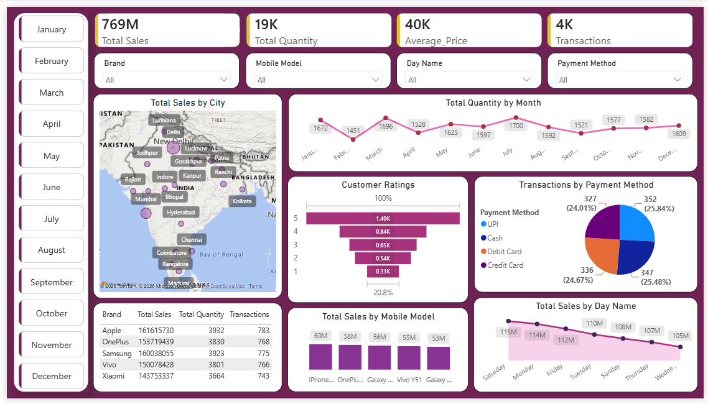

# 📊 Mobile Sales Dashboard – Power BI

## 📌 Project Overview

This project is an interactive **Mobile Sales Dashboard** created using **Microsoft Power BI** to analyze mobile phone sales performance.

The dashboard analyzes mobile phone sales performance and provides insights into total sales, quantity sold, transactions, customer ratings, payment methods, brand performance, mobile model performance, city-wise sales, monthly trends, and sales by day of the week.

The objective of this project was to practice data cleaning, data transformation, DAX calculations, data visualization, and interactive dashboard development using Power BI.


---

## 🎯 Objectives

The main objectives of this project are:

* Analyze overall mobile sales performance
* Track total sales revenue and quantity sold
* Identify top-performing mobile brands and models
* Analyze sales trends over time
* Understand customer purchasing behavior
* Compare different payment methods
* Analyze sales performance across different cities
* Identify key patterns and trends in the sales data
* Create an interactive dashboard for business analysis

---

## 📊 Dashboard Features

The dashboard includes the following key metrics and visualizations:

### 🔹 Key Performance Indicators (KPIs)

* **Total Sales**
* **Total Quantity Sold**
* **Total Transactions**
* **Average Selling Price**

### 🔹 Sales Analysis

* Monthly sales trends
* Sales by mobile brand
* Sales by mobile model
* Quantity sold by brand
* Sales performance over time

### 🔹 Customer Analysis

* Customer ratings
* Customer purchasing patterns
* Sales distribution based on customer characteristics

### 🔹 Payment Analysis

* Sales by payment method
* Comparison of different payment options

### 🔹 Geographic Analysis

* Sales performance by city
* Geographical distribution of mobile sales

### 🔹 Interactive Filters

Users can interact with the dashboard using filters/slicers such as:

* Brand
* Mobile Model
* Payment Method
* City
* Date
* Other available categories

These filters allow users to dynamically explore different aspects of the sales data.

---

## 🛠️ Tools & Technologies

* **Microsoft Power BI**
* **Power Query**
* **DAX**
* **Data Visualization**
* **Data Cleaning & Transformation**

---

## 📂 Project Structure

```text
Mobile-Sales-Dashboard/
│
├── README.md
├── mobile-sales-dashboard.pbix
└── mobile-sales-dashboard.png
```

---

## 🔄 Data Analysis Process

The project follows a basic data analytics workflow:

```text
Raw Data
   ↓
Data Cleaning & Transformation
   ↓
Data Modeling
   ↓
DAX Measures & Calculations
   ↓
Data Visualization
   ↓
Interactive Power BI Dashboard
   ↓
Business Insights
```

---

## 🧹 Data Cleaning & Transformation

The dataset was prepared using **Power Query** before creating the dashboard.

The data preparation process included tasks such as:

* Removing unnecessary columns
* Checking for missing values
* Correcting data types
* Cleaning inconsistent values
* Formatting date-related fields
* Preparing fields for analysis
* Creating appropriate columns for visualization

---

## 📐 Data Modeling & DAX

Power BI was used to create the data model and analytical calculations required for the dashboard.

DAX measures were used to calculate important business metrics such as:

* Total Sales
* Total Quantity
* Total Transactions
* Average Selling Price
* Other calculated performance indicators

These measures make the dashboard dynamic and allow the values to update automatically when filters are applied.

---

## 📈 Key Insights

The dashboard can be used to identify insights such as:

* Which mobile brands generate the highest sales
* Which mobile models are most popular
* How sales change over time
* Which cities contribute the most to overall sales
* Which payment methods are commonly used
* Customer rating patterns
* Overall sales and quantity performance

These insights can help businesses understand their sales performance and make data-driven decisions.

---

## 💡 Skills Demonstrated

This project demonstrates the following skills:

* Data Cleaning
* Data Transformation
* Data Analysis
* Data Modeling
* DAX
* Power Query
* KPI Development
* Data Visualization
* Dashboard Design
* Interactive Reporting
* Business Intelligence
* Insight Generation

---

## 🎓 How to Use

1. Download or clone this repository.
2. Open the `.pbix` file using **Microsoft Power BI Desktop**.
3. Refresh the data if required.
4. Use the available slicers and filters to interact with the dashboard.
5. Explore the visualizations and KPIs to analyze mobile sales performance.

---

## 📸 Dashboard Preview



---

## 📚 Project Purpose

This project was created as part of my **Data Analytics learning and portfolio development** to practice working with Power BI and demonstrate practical skills in data cleaning, analysis, visualization, and dashboard development.

---

## 👩‍💻 Author

**Priya Choudhary**

### Skills Demonstrated

* Microsoft Power BI
* Power Query
* DAX
* Data Cleaning
* Data Transformation
* Data Analysis
* Data Visualization
* Dashboard Development
* Business Intelligence

---

## 📌 Disclaimer

This project was created as a learning and portfolio project based on a Power BI tutorial.

The dataset and project concepts were obtained from the following YouTube tutorial:

Power BI Dashboard End to End Project with DAX Formula for Beginners 2025

🔗 https://www.youtube.com/watch?v=znJGWMtk_EE

---

